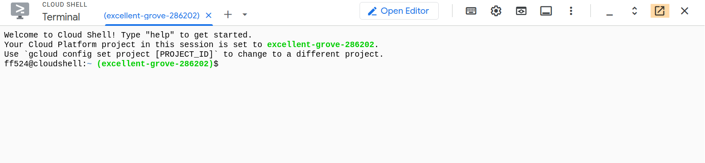
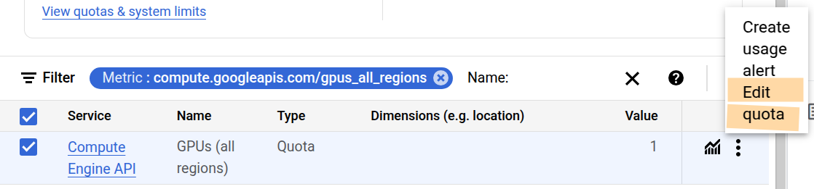

## GourmetGram on Google Cloud Platform

We've spent a lot of time training, serving, and evaluating a hypothetical machine learning service called GourmetGram on Chameleon Cloud. In this experiment, we see how some of those activities might translate to a commercial cloud: Google Cloud (although similar principles would apply to other commercial clouds).

These instructions assume that you have already redeemed education credits, and created a new project associated with that billing account! (If you previously had a Google Cloud account with a credit card attached to it, make sure you are working in the project that bills your education credits, not your personal credit card, to avoid being charged for your work.)

---

First, you will open the Google Cloud console in a web browser: [Google Cloud Console](https://console.cloud.google.com/)

Make sure you are working in the correct project - there is a selector in the menu bar at the top of the screen, just to the right of the "Google Cloud" logo. (It's highlighted green in the image below.)

### Open Cloud Shell

When working on Chameleon, we often used either a notebook or a terminal in the "Chameleon Jupyter environment" to provision resources. In this environment, we were already authenticated to the cloud provider. Similarly, on Google Cloud, we will open a terminal in which we are already authenticated, and then we can use this terminal to provision resources and perform basic interactions with the cloud provider. This terminal is called "Cloud Shell" in GPC.

To open the Cloud Shell, click on the terminal icon in the menu - highlighted in pink in the image below.


You will be asked to authorize the Cloud Shell. Then, Google Cloud will provision a VM and connect it to a browser-based terminal that you can use to interact with the service. It may take a few minutes the first time, or after some period of inactivity.

You can use the button highlighted in orange to bring the shell into its browser window, which may be more convenient.



Inside the Cloud Shell, set the `GCP_PROJECT_ID` environment variable, which we will use throughout this tutorial, to the name of *your* GCP project:

```
export GCP_PROJECT_ID="your-GCP-project-name"
```

Also run 

```
gcloud config set project
```

and make sure that Cloud Shell is configured to use the correct project.

### Enable APIs

To enable all required APIs for our workflow on Google Cloud Shell, run the following which covers various services across Kubernetes, Cloud Run, Vertex AI, Cloud Storage, Compute Engine, and Workbench:

```
gcloud services enable \
  compute.googleapis.com \
  container.googleapis.com \
  run.googleapis.com \
  artifactregistry.googleapis.com \
  cloudbuild.googleapis.com \
  storage.googleapis.com \
  notebooks.googleapis.com \
  aiplatform.googleapis.com
```


### Create a container image

We're going to explore a few different ways to host the GourmetGram service on GCP! But first, we'll create a container image for this service. We'll host the container image inside Google's Artifact Registry.

In your Cloud Shell:

```
# 1. Clone the repo and move into it
git clone https://github.com/teaching-on-testbeds/gourmetgram.git
cd gourmetgram

# 2. Set environment variables - used in the rest of these commands
export REGION="us-central1"
export REPO_NAME="gourmetgram-repo"
export IMAGE_NAME="gourmetgram"

# 3. Create Artifact Registry repo
gcloud artifacts repositories create $REPO_NAME \
    --repository-format=docker \
    --location=$REGION 

# 4. Configure Docker to use gcloud credentials
gcloud auth configure-docker $REGION-docker.pkg.dev

# 5. Build Docker image using your existing Dockerfile
docker build -t $REGION-docker.pkg.dev/$GCP_PROJECT_ID/$REPO_NAME/$IMAGE_NAME .

# 6. Push Docker image to Artifact Registry
docker push $REGION-docker.pkg.dev/$GCP_PROJECT_ID/$REPO_NAME/$IMAGE_NAME

# 7. List images to verify successful push
gcloud artifacts docker images list $REGION-docker.pkg.dev/$GCP_PROJECT_ID/$REPO_NAME
```

Now, if you open Artifact Registry in the Google Cloud Console web UI: [Artifact Registry](https://console.cloud.google.com/artifacts)

* you should see a "gourmetgram-repo" repository
* and inside it, a container image named "gourmetgram"
* and you can look at the latest version of this image to see more details


### Launch a Kubernetes cluster 

We had previously learned how to *manually* deploy a self-managed Kubernetes cluster, which takes quite a lot of time! Commercial cloud providers may offer Kubernetes as a managed service, which is much easier and faster to launch and operate. 

GCP's managed Kubernetes service is Google Kubernetes Engine (GKE). In your Cloud Shell, let's launch a Kubernetes cluster using GKE.

Note that the Kubernetes manifest we will apply references the container image we created in the previous step, which is hosted in Artifact Registry.

```
# 1. Set environment variables
export REGION="us-central1"
export REPO_NAME="gourmetgram-repo"
export IMAGE_NAME="gourmetgram"
export CLUSTER_NAME="gourmetgram-cluster"
export DEPLOYMENT_NAME="gourmetgram-deployment"
export SERVICE_NAME="gourmetgram-service"

# 2. Create GKE Autopilot Cluster
gcloud container clusters create-auto $CLUSTER_NAME --region=$REGION
gcloud container clusters get-credentials $CLUSTER_NAME --region $REGION
```

It will take a few minutes to launch the cluster. Once the cluster is launched, you can deploy the GourmetGram service, and set up autoscaling of pods on the cluster:

```
# 3. Create Kubernetes Deployment & Service YAML
cd
cat > gourmetgram-deployment.yaml <<EOF
apiVersion: apps/v1
kind: Deployment
metadata:
  name: gourmetgram-deployment
spec:
  replicas: 2
  selector:
    matchLabels:
      app: gourmetgram
  template:
    metadata:
      labels:
        app: gourmetgram
    spec:
      containers:
      - name: gourmetgram
        image: $REGION-docker.pkg.dev/$GCP_PROJECT_ID/$REPO_NAME/$IMAGE_NAME
        ports:
        - containerPort: 8000
        resources:
          limits:
            memory: "2Gi"
            cpu: "1"
          requests:
            memory: "1Gi"
            cpu: "500m"
        livenessProbe:
          httpGet:
            path: /test
            port: 8000
          initialDelaySeconds: 10
          periodSeconds: 30
        readinessProbe:
          httpGet:
            path: /test
            port: 8000
          initialDelaySeconds: 5
          periodSeconds: 10
---
apiVersion: v1
kind: Service
metadata:
  name: $SERVICE_NAME
spec:
  type: LoadBalancer
  selector:
    app: gourmetgram
  ports:
    - protocol: TCP
      port: 80
      targetPort: 8000
EOF

# 4. Apply Deployment & Service
kubectl apply -f gourmetgram-deployment.yaml

# 5. Set up Horizontal Pod Autoscaler
kubectl autoscale deployment $DEPLOYMENT_NAME --cpu-percent=50 --min=1 --max=5

# 6. Get External IP (wait and re-run this, until an IP is assigned)
kubectl get service $SERVICE_NAME
```

Initially, it will the "EXTERNAL-IP" as pending:


```
NAME                  TYPE           CLUSTER-IP       EXTERNAL-IP   PORT(S)        AGE
gourmetgram-service   LoadBalancer   34.118.225.132   <pending>     80:31515/TCP   1s
```

you can re-run 

```
kubectl get service $SERVICE_NAME
```

until an external IP is assigned. 

Use

```
kubectl get all
```

to see when your pods are Running and have a `1/1` in the READY column.


Then, you can access the service at

```
http://A.B.C.D
```

where you substitute the external IP in place of `A.B.C.D`.

You can check on your cluster using the Google Cloud Console web UI: [Kubernetes Engine](https://console.cloud.google.com/kubernetes)

Click on the "Observability" tab to see some basic information about your cluster.

### Serverless

For a service that is always on, with variable and potentially high load, a Kubernetes cluster might be the best choice. However, if you have a lightweight service that is used intermittently, you might prefer to run it as a serverless instance. The commercial cloud provider manages the logistics of bringing up an active instance when it is needed, and letting it go when it is not.

We will deploy GourmetGram using Google Cloud Run, which is a serverless offering from Google Cloud.

(These instructions assume you have already defined the environment variables in the previous steps!)

```
# 1. Deploy to Cloud Run
gcloud run deploy $SERVICE_NAME \
  --image $REGION-docker.pkg.dev/$GCP_PROJECT_ID/$REPO_NAME/$IMAGE_NAME \
  --platform managed \
  --region $REGION \
  --allow-unauthenticated \
  --port 8000 \
  --memory=2Gi \
  --timeout=600

# 2. Get the deployed service URL
gcloud run services describe $SERVICE_NAME --region $REGION --format 'value(status.url)'
```

Note that we are using the container image we created in an earlier step, which is hosted in Artifact Registry.


Open the GourmetGram service using the URL printed in the terminal by the last step, and test it.

You can see your Cloud Run service in the Google Cloud Console web UI: [Cloud Run](https://console.cloud.google.com/run) 

Click on the "Metrics" tab; this will show you the number of active instances running for your service over time. You can change the time scale from "Last 1 day" to a shorter time scale.

As you generate traffic against your service, you will see the "Container instance count" scale up the number of active containers. However, when your service is idle for a while, it will scale down again.

### Request GPU quota increase

In the following section, we will bring up a Jupyter instance attached to a GPU, for training or evaluating GourmetGram's model. You will first need to increase the GPU quota for your project.

In the Google Cloud Console web UI, open: [Quotas & System Limits](https://console.cloud.google.com/iam-admin/quotas)

Type `GPUS_ALL_REGIONS` into the "Filter" bar and then accept the suggested keyword. Click the checkbox next to the correponding service/quota, and use the menu on the right side to select "Edit Quota".



Specify the new value for number of GPUs as 1, and enter some text explaining what you will use the GPU for (e.g. "learn how to use GPUs on Google Cloud"). Then click Done. You will get an email about the outcome of your quota increase request.


### Get data into object store

To serve GourmetGram, we only need the container image; but if we are going to train or evaluate it, we will also need to get our Food 11 data into Google Cloud. In this section, we will load the data into Cloud Storage, which is their object storage service.

First, create a bucket:

```
# 1. Create a bucket
gcloud storage buckets create gs://food11-dataset-bucket \
    --location=us-central1 \
    --uniform-bucket-level-access
```

Next, bring up a VM instance as a "staging area" to download the dataset, process it, and load it into that object storage:

```
# 2. Bring up a VM compute instance
gcloud compute instances create food11-setup-vm \
    --zone=us-central1-a \
    --machine-type=e2-standard-2 \
    --boot-disk-size=50GB \
    --image-family=debian-11 \
    --image-project=debian-cloud \
    --scopes=storage-rw

# 3. SSH into VM
gcloud compute ssh food11-setup-vm --zone=us-central1-a
```

After running the previous step, your terminal prompt will change, indicating that you are now on the VM, e.g.:

```
ff524@food11-setup-vm:~$ 
```

Once on the VM instance, you can run the following:

```
sudo apt-get update
sudo apt-get install -y python3 python3-pip unzip

mkdir -p ~/Food-11 && cd ~/Food-11

echo "Downloading dataset..."
curl -L https://nyu.box.com/shared/static/m5kvcl25hfpljul3elhu6xz8y2w61op4.zip --output Food-11.zip

echo "Extracting dataset..."
unzip -q Food-11.zip
rm Food-11.zip
```

```
python3 - <<EOF
import os
import shutil

dataset_base_dir = "/home/$(whoami)/Food-11"
subdirs = ["training", "validation", "evaluation"]
classes = ["Bread", "Dairy product", "Dessert", "Egg", "Fried food",
    "Meat", "Noodles/Pasta", "Rice", "Seafood", "Soup", "Vegetable/Fruit"]

for subdir in subdirs:
    dir_path = os.path.join(dataset_base_dir, subdir)
    if not os.path.exists(dir_path):
        continue
    for i in range(len(classes)):
        class_dir = os.path.join(dir_path, f"class_{i:02d}")
        os.makedirs(class_dir, exist_ok=True)
        files = [f for f in os.listdir(dir_path) if f.startswith(f"{i}_")]
        for f in files:
            shutil.move(os.path.join(dir_path, f), os.path.join(class_dir, f))

print("Dataset setup complete.")
EOF
```

```
# upload organized dataset to your bucket on GCS
gsutil -m -q cp -r ~/Food-11 gs://food11-dataset-bucket/datasets/Food-11
```

``` 
# exit the VM
exit
```

Now your terminal should indicate that you are back in the Cloud Shell! Delete the VM that you used as a staging area:

```
4. Delete the VM instance
gcloud compute instances delete food11-setup-vm --zone=us-central1-a --quiet
```

In the Google Cloud Console web UI, you can see your bucket and the data in it: [Cloud Storage](https://console.cloud.google.com/storage/browser)

### Bring up a Jupyter notebook with GPU

Now, we will bring up a PyTorch Jupyter notebook with a GPU attached to it, download the Food11 evaluation data from Google Cloud Storage into the notebook environment, and use it to evaluate the Food11 model!

In Cloud Shell, bring up a Jupyter notebook via Google's Vertex AI Workbench service:

```
gcloud workbench instances create my-gpu-notebook \
    --location=us-central1-a \
    --machine-type=n1-standard-4 \
    --accelerator-type=NVIDIA_TESLA_P4 \
    --accelerator-core-count=1 \
    --data-disk-type=PD_STANDARD \
    --data-disk-size=100 \
    --container-repository=gcr.io/deeplearning-platform-release/pytorch-gpu.2-4.py310 \
    --container-tag=latest
```

You can see your notebook instance on the Google Cloud Console web UI: [Vertex AI Workbench](https://console.cloud.google.com/vertex-ai/workbench)

Click "Open JupyterLab" to open the notebook environment.

Inside the notebook environment, open a terminal. Run

```
nvidia-smi
```

and confirm that you can see the GPU attached.

Next, inside the terminal in the notebook environment, copy the Food11 evaluation data from the Cloud Storage bucket to the filesystem in the notebook environment:

```
mkdir /home/jupyter/Food-11
gsutil -m -q cp -r gs://food11-dataset-bucket/datasets/Food-11/evaluation /home/jupyter/Food-11/
```

Now, we can run an evaluation job. First, let's get the model to evaluate and a notebook to run:

```
git clone https://github.com/teaching-on-testbeds/eval-offline-chi
cp -R eval-offline-chi/workspace/* .
```

Now, you can open "4_eval_offline.ipynb" and run the notebook.

### Delete your resources

When you are finished, make sure to delete all your resources in the Google Cloud Console:

* Delete your Jupyter instance in [Vertex AI Workbench](https://console.cloud.google.com/vertex-ai/workbench)
* Delete your bucket in [Cloud Storage](https://console.cloud.google.com/storage/browser)
* Delete your cluster in [Kubernetes Engine](https://console.cloud.google.com/kubernetes)
* Delete your service in [Cloud Run](https://console.cloud.google.com/run)
* Delete your container image and container image repository in [Artifact Registry](https://console.cloud.google.com/artifacts)