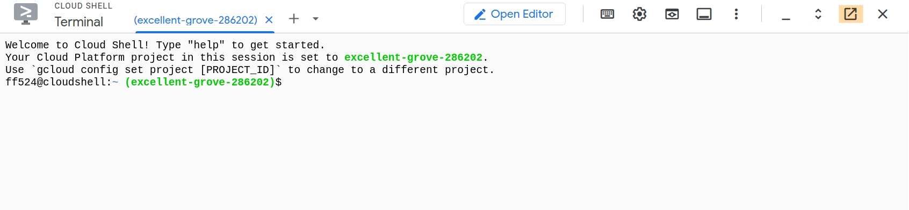
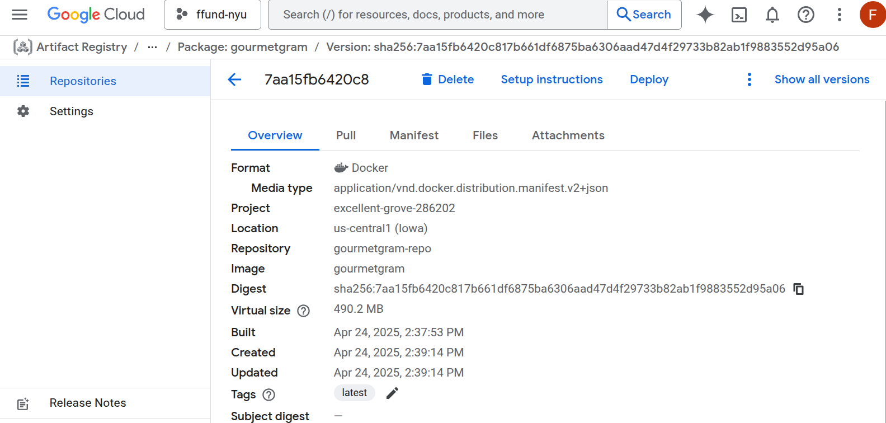

## GourmetGram on Google Cloud Platform

We've spent a lot of time training, serving, and evaluating a hypothetical machine learning service called GourmetGram on Chameleon Cloud. In this experiment, we see how some of those activities might translate to a commercial cloud: Google Cloud (although similar principles would apply to other commercial clouds).

We will focus specifically on *managed services* offered by the cloud provider. We already know how to run GourmetGram and many associated services (data platforms, ML platforms) directly inside a generic VM instance on Chameleon; we could launch a VM on Google Cloud and run GourmetGram exactly the same way. 

However, this lab emphasizes cloud provider-managed services that can help us reduce some of the operational overhead associated with the self-managed VM approach. 

---

### Redeem education credits

Students should have received an email with a link to redeem a $50 education coupon for GCP.

Go to the Google cloud console (https://cloud.google.com/) and sign in with your NYU account (netID@nyu.edu). The coupon is only valid for your nyu.edu email address.

Click on the link in the email to redeem your coupon. You will be directed to a "GCP credit application", where you will fill in some information and agree to terms of use. 

When you have successfully redeemed the coupon, you will be redirected to an overview page for the "Billing account for Education" account.  You should be able to see your education credits in the 'Credits' section of the billing account.


### Create a GCP project

Our next step will be to create a GCP project associated with this billing account. If it is not open already, open the Google Cloud console in a web browser: [Google Cloud Console](https://console.cloud.google.com/)

Create a new project for this lab. Click on the project selector in the menu bar at the top of the screen, just to the right of the "Google Cloud" logo (it's highlighted green in the image below).


In the project selector dialog:

1. Click "New Project"
2. Set the "Project name" to `gourmetgram-gcp-lab` (note: Google Cloud projects have a unique global *ID* but don't necessarily have a unique *name*. Your project *ID* will have some extra numbers at the end, to make it globally unique.)
3. Make sure "Billing account" is set to "Billing account for Education". This is the name used for billing accounts created using educational coupons.
4. For "Organization", select the organization associated with your education credits (e.g. `nyu.edu`)
5. For "Location" (parent folder), select the appropriate folder under your organization (e.g. "NYU-GCP-Personal-Projects")
6. Click "Create"

Once the project is created, make sure it is selected as the active project using the project selector in the menu bar.

> Important: If you previously had a Google Cloud account with a credit card attached to it, make sure you are working in this new project that bills your education credits, not your personal credit card, to avoid being charged for your work.

Go to [Billing](https://console.cloud.google.com/billing) and make sure your `gourmetgram-gcp-lab` project is associated with the billing account that has your education credits.  Select the "Billing account for Education" account. Then, in the sidebar on the left side, scroll down to "Billing management" and then click on "Account management". Confirm that the `gourmetgram-gcp-lab` project is listed there.

### Open Cloud Shell

When working on Chameleon, we often used either a notebook or a terminal in the "Chameleon Jupyter environment" to provision resources. In this environment, we were already authenticated to the cloud provider. Similarly, on Google Cloud, we will open a terminal in which we are already authenticated, and then we can use this terminal to provision resources and perform basic interactions with the cloud provider. This terminal is called "Cloud Shell" in GPC.

To open the Cloud Shell, click on the terminal icon in the menu - highlighted in pink in the image below.


You will be asked to authorize the Cloud Shell. Then, Google Cloud will provision a VM and connect it to a browser-based terminal that you can use to interact with the service. It may take a few minutes the first time, or after some period of inactivity.

You can use the button highlighted in orange to bring the shell into its browser window, which may be more convenient.



The terminal prompt should show that you are working in your `gourmetgram-gcp-lab` project, e.g.

```
ff524@cloudshell:~ (gourmetgram-gcp-lab-494600)$ 
```

and if you run 

```
echo $GOOGLE_CLOUD_PROJECT
```

inside this shell, you should see your project ID. Also, if you run


```
echo $USER
```

you will see your user ID. Take a screenshot showing both `echo` commands and their output.

Now clone this lab repository in Cloud Shell (we will reuse files from it throughout the lab):

```
# run in Cloud Shell
git clone https://github.com/teaching-on-testbeds/gourmetgram-gcp.git
cd gourmetgram-gcp
```

---

In case you get disconnected from Cloud Shell and re-connect, you may end up in a state where you are not working "in" your project, and then you will encounter authentication errors; if you ever see that your prompt does *not* include the project name, you will need to fix that! 

It's always a safe bet to re-open Cloud shell with the following procedure:

* Close any existing Cloud Shell
* Go back to the [https://console.cloud.google.com/](https://console.cloud.google.com/) home page
* Make sure you are using the correct project.
* Click on the Cloud Shell icon.

since this will trigger the authorization flow.

---


Inside the Cloud Shell, let us set the `GCP_PROJECT_ID` environment variable, which we will use throughout this tutorial:

```
# run in Cloud Shell
export GCP_PROJECT_ID="$GOOGLE_CLOUD_PROJECT"
```

> Note: The images in this tutorial may show a different project name, `excellent-grove-286202`, because I took screenshots in a project with that randomly generated name.

### Enable APIs

By default, your Google Cloud project is configured with APIs disabled; this is a security measure to reduce attack surface.

To enable all required APIs for our workflow on Google Cloud Shell, run the following which covers various services across Kubernetes, Cloud Run, Agent Platform, Cloud Storage, Compute Engine, Cloud Build, and Monitoring:

In GCP, products are exposed as service APIs. Enabling an API activates that product in your project so both the console and `gcloud` can create and manage its resources.

```
# run in Cloud Shell
gcloud services enable \
  compute.googleapis.com \
  container.googleapis.com \
  run.googleapis.com \
  artifactregistry.googleapis.com \
  cloudbuild.googleapis.com \
  storage.googleapis.com \
  notebooks.googleapis.com \
  aiplatform.googleapis.com \
  monitoring.googleapis.com \
  logging.googleapis.com \
  eventarc.googleapis.com \
  cloudscheduler.googleapis.com \
  workflows.googleapis.com \
  batch.googleapis.com
```

## Build container images in GCP

### Create a container image

We're going to explore a few different ways to host the GourmetGram service on GCP! But first, we'll create a container image for this service. We'll host the container image inside Google's Artifact Registry.

In your Cloud Shell:

```
# run in Cloud Shell
# 1. Clone the lab repo and move into the app directory
export REPO_NAME="gourmetgram-repo"
export REGION="us-central1"
export GCP_PROJECT_ID="$GOOGLE_CLOUD_PROJECT"
export IMAGE_NAME="gourmetgram"

cd ~/
git clone https://github.com/teaching-on-testbeds/gourmetgram
cd gourmetgram

# 2. Set environment variables - used in the rest of these commands
export REGION="us-central1"
export REPO_NAME="gourmetgram-repo"
export IMAGE_NAME="gourmetgram"

# 3. Create Artifact Registry repo
gcloud artifacts repositories create $REPO_NAME \
    --repository-format=docker \
    --location=$REGION

# 4. Configure Docker to use gcloud credentials
gcloud auth configure-docker $REGION-docker.pkg.dev

# 5. Build Docker image using your existing Dockerfile
docker build -t $REGION-docker.pkg.dev/$GCP_PROJECT_ID/$REPO_NAME/$IMAGE_NAME .


# 6. Push Docker image to Artifact Registry
docker push $REGION-docker.pkg.dev/$GCP_PROJECT_ID/$REPO_NAME/$IMAGE_NAME

# 7. List images to verify successful push
gcloud artifacts docker images list $REGION-docker.pkg.dev/$GCP_PROJECT_ID/$REPO_NAME
```

Now, if you open Artifact Registry in the Google Cloud Console web UI: [Artifact Registry](https://console.cloud.google.com/artifacts)

* you should see a "gourmetgram-repo" repository
* and inside it, a container image named "gourmetgram"
* and you can look at the latest version of this image to see more details



Take a screenshot from Artifact Registry showing this container.

### Build with Cloud Build

In the previous step, we manually ran `docker build` and `docker push` from Cloud Shell to create and upload our container image. This works, but it depends on having Docker available locally and running the commands by hand each time. Google Cloud Build lets you offload the build to Google's infrastructure — you submit your source code and a build config, and Cloud Build builds the image and pushes it to Artifact Registry for you.

The `cloudbuild` branch of the `gourmetgram` repository includes a `cloudbuild.yaml` that defines the build steps. To see it, first, make sure you are in the `gourmetgram` directory, then switch to the `cloudbuild` branch:

```
# run in Cloud Shell
cd ~/gourmetgram
export REGION="us-central1"
export GCP_PROJECT_ID="$GOOGLE_CLOUD_PROJECT"
export REPO_NAME="gourmetgram-repo"

git checkout cloudbuild
```

The repo already includes a `cloudbuild.yaml`. You can view it:

```
# run in Cloud Shell
cat cloudbuild.yaml
```

It defines a single build step that builds the Docker image and pushes it to Artifact Registry. 

* The `substitutions` block provides default values for the region, repo name, and image name — Cloud Build runs remotely and cannot access your local shell variables, so these are passed as build-time substitutions instead. 
* The `PROJECT_ID` variable will be substituted automatically.

> Note: Cloud Build can build and push images, but it does not create the Artifact Registry repository itself. We already created it in the "Create a container image" step earlier — Cloud Build pushes to that existing repository.

Now submit the build:

```
# run in Cloud Shell
gcloud builds submit --config=cloudbuild.yaml .
```

This will upload your source code to Cloud Build, build the Docker image remotely, and push it to Artifact Registry. You'll see the build logs streaming in your terminal.

You can also view the build in the Google Cloud Console web UI: [Cloud Build](https://console.cloud.google.com/cloud-build/builds)


Once the build completes, verify the new image is in Artifact Registry:

```
# run in Cloud Shell
gcloud artifacts docker images list $REGION-docker.pkg.dev/$GCP_PROJECT_ID/$REPO_NAME
```

You should see a new image with a recent timestamp — this is the one built by Cloud Build, not by running Docker commands in Cloud Shell.


## Deploy on GCP compute

### Deploy on Compute Engine 

Let's start by deploying this container on a VM using Compute Engine, GCP's basic VM service. 

```
# run in Cloud Shell
# 1. Set VM variables
export GCP_PROJECT_ID="$GOOGLE_CLOUD_PROJECT"
export VM_NAME="gourmetgram-vm"
export VM_ZONE="us-central1-a"
export REGION="us-central1"
export REPO_NAME="gourmetgram-repo"
export IMAGE_NAME="gourmetgram"

export VM_NAME="gourmetgram-vm"
export VM_ZONE="us-central1-a"

# 2. Create firewall rule for port 8000
gcloud compute firewall-rules create allow-gourmetgram-vm \
  --allow=tcp:8000 \
  --target-tags=gourmetgram-vm

# 3. Grant IAM Artifact Registry Reader role so the VM's default service account can authenticate and pull the private container image at startup
PROJECT_NUMBER=$(gcloud projects describe $GCP_PROJECT_ID --format='value(projectNumber)')
COMPUTE_SA="${PROJECT_NUMBER}-compute@developer.gserviceaccount.com"
gcloud projects add-iam-policy-binding $GCP_PROJECT_ID \
  --member="serviceAccount:${COMPUTE_SA}" \
  --role="roles/artifactregistry.reader"

# 4. Create Ubuntu VM and run the container using an inline startup script
gcloud compute instances create $VM_NAME \
  --zone=$VM_ZONE \
  --machine-type=e2-medium \
  --tags=gourmetgram-vm \
  --image-family=ubuntu-2204-lts \
  --image-project=ubuntu-os-cloud \
  --scopes=https://www.googleapis.com/auth/cloud-platform \
  --metadata=startup-script='#!/bin/bash
set -e
apt-get update
apt-get install -y docker.io
systemctl enable --now docker

TOKEN=$(curl -s -H "Metadata-Flavor: Google" \
  "http://metadata.google.internal/computeMetadata/v1/instance/service-accounts/default/token" \
  | sed -n "s/.*\"access_token\":\"\\([^\"]*\\)\".*/\\1/p")

echo "$TOKEN" | docker login -u oauth2accesstoken --password-stdin https://'"$REGION"'-docker.pkg.dev
docker run -d --restart=always -p 8000:8000 '"$REGION"'-docker.pkg.dev/'"$GCP_PROJECT_ID"'/'"$REPO_NAME"'/'"$IMAGE_NAME"'
'

export VM_NAME="gourmetgram-vm"
export VM_ZONE="us-central1-a"

```

Although it is not strictly necessary to SSH to the instance, let's do so in order to watch as this setup script runs:

1. Open the Compute Engine VM list in the UI: [Compute Engine](https://console.cloud.google.com/compute/instances). Take a screenshot of `gourmetgram-vm`.
2. Click `gourmetgram-vm`, then click `SSH` (and authorize) to open a terminal on the VM.
3. Run:

```
# run in SSH session on VM instance
sudo journalctl -u google-startup-scripts.service -f
```

One you see that there are no errors and it is finished, e.g.

```
Finished Google Compute Engine Startup Scripts.
google-startup-scripts.service: Consumed 28.373s CPU time.
```

you can close the SSH session. 

Let's test it! Get the external IP and verify the service:

```
# run in Cloud Shell

# 5. Get VM external IP
gcloud compute instances describe $VM_NAME \
  --zone=$VM_ZONE \
  --format='value(networkInterfaces[0].accessConfigs[0].natIP)'
```

Open `http://<VM_EXTERNAL_IP>:8000` in your browser and upload an image to confirm that it's serving. Take a screenshot.

### Launch a Kubernetes cluster

In a previous lesson, we learned about some of the advantages of a Kubernetes deployment vs. a single container running in a VM. And, we had previously learned how to *manually* deploy a self-managed Kubernetes cluster, which takes quite a lot of time! Commercial cloud providers may offer Kubernetes as a managed service, which is much easier and faster to launch and operate.

GCP's managed Kubernetes service is Google Kubernetes Engine (GKE). In your Cloud Shell, let's launch a Kubernetes cluster using GKE.

Note that the Kubernetes manifest we will apply references the container image we created in the previous step, which is hosted in Artifact Registry.

```
# run in Cloud Shell
# 1. Set environment variables
export CLUSTER_NAME="gourmetgram-cluster"
export REGION="us-central1"
export GCP_PROJECT_ID="$GOOGLE_CLOUD_PROJECT"
export REPO_NAME="gourmetgram-repo"
export IMAGE_NAME="gourmetgram"
export SERVICE_NAME="gourmetgram-service"
export DEPLOYMENT_NAME="gourmetgram-deployment"

export REGION="us-central1"
export REPO_NAME="gourmetgram-repo"
export IMAGE_NAME="gourmetgram"
export CLUSTER_NAME="gourmetgram-cluster"
export DEPLOYMENT_NAME="gourmetgram-deployment"
export SERVICE_NAME="gourmetgram-service"

# 2. Create GKE Autopilot Cluster
gcloud container clusters create-auto $CLUSTER_NAME --region=$REGION
gcloud container clusters get-credentials $CLUSTER_NAME --region $REGION
```

It will take a few minutes to launch the cluster. Once the cluster is launched, you can deploy the GourmetGram service, and set up autoscaling of pods on the cluster:

```
# run in Cloud Shell

# 3. Go to the Kubernetes assets in this repo
cd ~/gourmetgram-gcp/cloudshell/kubernetes-cluster

# 4. Apply Deployment & Service YAML from repo
envsubst < gourmetgram-deployment.yaml | kubectl apply -f -

# 5. Set up Horizontal Pod Autoscaler
kubectl autoscale deployment $DEPLOYMENT_NAME --cpu=50% --min=1 --max=5

# 6. Get External IP (wait and re-run this, until an IP is assigned)
kubectl get service $SERVICE_NAME
```

Initially, it will show the "EXTERNAL-IP" as pending:

```
NAME                  TYPE           CLUSTER-IP       EXTERNAL-IP   PORT(S)        AGE
gourmetgram-service   LoadBalancer   34.118.225.132   <pending>     80:31515/TCP   1s
```

you can re-run

```
# run in Cloud Shell
kubectl get service $SERVICE_NAME
```

until an external IP is assigned. (It may take up to 10 minutes.)

Use

```
# run in Cloud Shell
kubectl get all
```

to see when your pods are Running and have a `1/1` in the READY column. Since we set `replicas: 2` in the deployment, you should see 2 pods reach `1/1` READY. This may take a few minutes — pods might initially show errors or restarts while the nodes spin up, which is normal for GKE Autopilot. Just wait and re-run the command until all pods are ready.

Then, you can access the service at

```
http://A.B.C.D
```

where you substitute the external IP in place of `A.B.C.D`. Verify that the service is running, and returns a prediction when you upload an image. Take a screenshot.

You can check on your cluster using the Google Cloud Console web UI: [Kubernetes Engine](https://console.cloud.google.com/kubernetes). Take a screenshot.

Click on the "Observability" tab to see some basic information about your cluster. 

### Deploy a serverless service

For a service that is always on, with variable and potentially high load, a Kubernetes cluster might be the best choice. However, if you have a lightweight service that is used intermittently, you might prefer to run it as a serverless instance. The commercial cloud provider manages the logistics of bringing up an active instance when it is needed, and letting it go when it is not.

We will deploy GourmetGram using Google Cloud Run, which is a serverless offering from Google Cloud.

(Note: These instructions assume you have already defined the environment variables in the previous steps!)

To deploy to Cloud Run:

```
# run in Cloud Shell
# 1. Deploy to Cloud Run
export SERVICE_NAME="gourmetgram-service"
export REGION="us-central1"
export GCP_PROJECT_ID="$GOOGLE_CLOUD_PROJECT"
export REPO_NAME="gourmetgram-repo"
export IMAGE_NAME="gourmetgram"

gcloud run deploy $SERVICE_NAME \
  --image $REGION-docker.pkg.dev/$GCP_PROJECT_ID/$REPO_NAME/$IMAGE_NAME \
  --platform managed \
  --region $REGION \
  --allow-unauthenticated \
  --port 8000 \
  --memory=2Gi \
  --timeout=600

# 2. Get the deployed service URL
gcloud run services describe $SERVICE_NAME --region $REGION --format 'value(status.url)'
```

Note that we are using the container image we created in an earlier step, which is hosted in Artifact Registry.

Open the GourmetGram service using the URL printed in the terminal by the last step, and test that it returns a prediction when you upload an image. Take a screenshot.

You can see your Cloud Run service in the Google Cloud Console web UI: [Cloud Run](https://console.cloud.google.com/run). Take a screenshot.

Click on the "Metrics" tab; this will show you the number of active instances running for your service over time. You can change the time scale from "Last 1 day" to a shorter time scale.

As you generate traffic against your service (you can keep hitting the `/test` endpoint to make it easier), you will see the "Container instance count" scale up the number of active containers. However, when your service is idle for a while, it will scale down again - even to zero. There is a tradeoff: a request that arrives when the service is scaled down to zero will have longer delay while a new instance is spun up.


## Work with data

Now that we have explored some compute options, let's set up a data pipeline for our GourmetGram service. 

### Create object storage buckets

We'll use three Cloud Storage buckets:

- `raw`: captures incoming production images and intermediate data
- `labeled`: stores class-organized data ready for training workflows
- `training`: stores external data and versioned retraining datasets

Bucket names in Cloud Storage must be unique across all of GCP, so we include your Cloud Shell username (`$USER`). Otherwise, we would all try to create the same buckets!

```
# run in Cloud Shell
echo $USER
export GCS_RAW_BUCKET="gourmetgram-raw-bucket-${USER}"
export GCS_LABELED_BUCKET="gourmetgram-labeled-bucket-${USER}"
export GCS_TRAINING_BUCKET="gourmetgram-training-bucket-${USER}"


export GCS_RAW_BUCKET="gourmetgram-raw-bucket-${USER}"
echo $GCS_RAW_BUCKET

# 1. Create the raw bucket
gcloud storage buckets create gs://$GCS_RAW_BUCKET \
    --location=us-central1 \
    --uniform-bucket-level-access

export GCS_LABELED_BUCKET="gourmetgram-labeled-bucket-${USER}"
echo $GCS_LABELED_BUCKET

# 2. Create the labeled bucket
gcloud storage buckets create gs://$GCS_LABELED_BUCKET \
    --location=us-central1 \

    --uniform-bucket-level-access

export GCS_TRAINING_BUCKET="gourmetgram-training-bucket-${USER}"
echo $GCS_TRAINING_BUCKET

# 3. Create the training bucket
gcloud storage buckets create gs://$GCS_TRAINING_BUCKET \
    --location=us-central1 \
    --uniform-bucket-level-access
```

You can verify all three buckets were created in the Google Cloud Console: [Cloud Storage](https://console.cloud.google.com/storage/browser). Take a screenshow showing all three buckets.

### Save production data in Cloud Storage

Let's now try running a version of the `gourmetgram` service that uploads each image to the GCS bucket after making a prediction. (We do this upload asynchronously, so the user does not have to wait for it.)

Cloud Storage is a managed object-store data service. In this stage, Cloud Run remains the online inference compute service, and Cloud Storage becomes the durable data layer for labeled images.

You should already have the `gourmetgram` repo from earlier steps. For this stage, switch to the `cloudstorage` branch, build, and deploy that version.

```
# run in Cloud Shell
# 1. Go to the existing app repo and switch branches
export GCP_PROJECT_ID="$GOOGLE_CLOUD_PROJECT"
export GCS_LABELED_BUCKET="gourmetgram-labeled-bucket-${USER}"
export SERVICE_NAME="gourmetgram-service"
export REGION="us-central1"
export REPO_NAME="gourmetgram-repo"
export IMAGE_NAME="gourmetgram"
export IMAGE_TAG="cloudstorage"

cd ~/gourmetgram
git fetch origin
git checkout cloudstorage

# 2. Export required variables
export GCP_PROJECT_ID="$GOOGLE_CLOUD_PROJECT"
export REGION="us-central1"
export REPO_NAME="gourmetgram-repo"
export IMAGE_NAME="gourmetgram"

export IMAGE_TAG="cloudstorage"
export SERVICE_NAME="gourmetgram-service"

# 3. Build and push image with Cloud Build
gcloud builds submit --config=cloudbuild.yaml .
# Note: now verify in Artifact Registry that this build 
# produced an image tagged `cloudstorage`

# 4. Grant Cloud Run runtime service account write access to labeled bucket
PROJECT_NUMBER=$(gcloud projects describe $GCP_PROJECT_ID --format='value(projectNumber)')
COMPUTE_SA="${PROJECT_NUMBER}-compute@developer.gserviceaccount.com"
gcloud storage buckets add-iam-policy-binding gs://$GCS_LABELED_BUCKET \
  --member="serviceAccount:${COMPUTE_SA}" \
  --role="roles/storage.objectAdmin"

# 5. Deploy to Cloud Run with labeled bucket configured
gcloud run deploy $SERVICE_NAME \
  --image $REGION-docker.pkg.dev/$GCP_PROJECT_ID/$REPO_NAME/$IMAGE_NAME:$IMAGE_TAG \
  --platform managed \
  --region $REGION \

  --allow-unauthenticated \
  --port 8000 \
  --memory=2Gi \
  --timeout=600 \
  --set-env-vars="GCS_LABELED_BUCKET=$GCS_LABELED_BUCKET"
```

Authentication note: the app writes to GCS using the Cloud Run runtime service account (IAM), not static keys. By default this is the Compute Engine default service account (`<PROJECT_NUMBER>-compute@developer.gserviceaccount.com`). In the snippet above, we made sure the service account has permission to write to the bucket.


Open [Artifact Registry](https://console.cloud.google.com/artifacts) and confirm `cloudstorage`-tagged version of the `gourmetgram` image is there. Take a screenshot with the tag visible.

Get the service URL for the Cloud Run service you just deployed:

```
# run in Cloud Shell
gcloud run services describe $SERVICE_NAME --region $REGION --format='value(status.url)'
```

Open that URL in your browser, upload a food image using the page UI, and submit it for inference. Take a screenshot.

Then verify the output image was written to the `labeled` bucket, organized by class:

1. Open [Cloud Storage](https://console.cloud.google.com/storage/browser)
2. Click your labeled bucket: the one with a name that starts with `gourmetgram-labeled-bucket`
3. Open a `class_XX/` folder and confirm a new image file appears. Take a screenshot.

Upload a few more images belonging to different classes, to populate your "labeled" production bucket.


### Trigger event-driven flows with Eventarc

So far, we used a request-driven flow where inference happened first and storage happened second: a user submitted an image to the app, the app ran inference, then wrote the result to Cloud Storage. But many production pipelines need the opposite order: images arrive in storage first (from batch feeds, mobile uploads, or partner systems), and inference should run automatically afterward. 

Eventarc supports this storage-first pattern. Eventarc is Google Cloud's event routing service; it connects source events (like new objects in Cloud Storage) to destination services (like Cloud Run).

In this lab, we use Eventarc to implement the following pipeline:

1. A file is uploaded to the `raw` bucket
2. Eventarc detects the event when the object is finalized
3. Eventarc invokes our Cloud Run service at an `/event` endpoint, sending an event payload with object metadata (e.g., path)
4. The service downloads the raw image, runs inference, and writes the result to the `labeled` bucket under `class_XX/`

This pattern is useful when images come from many sources (batch jobs, partner systems, mobile uploads) and you want asynchronous processing instead of direct request/response calls.

Under the hood, this flow uses Pub/Sub as the event transport layer: when an object is finalized in Cloud Storage, that event is delivered through Pub/Sub and routed by Eventarc to your Cloud Run endpoint.

Let us deploy the `eventarc` branch and set up the trigger:

```
# run in Cloud Shell

export SERVICE_NAME="gourmetgram-service"
export REGION="us-central1"
export GCP_PROJECT_ID="$GOOGLE_CLOUD_PROJECT"
export REPO_NAME="gourmetgram-repo"
export IMAGE_NAME="gourmetgram"
export IMAGE_TAG="eventarc"
export GCS_RAW_BUCKET="gourmetgram-raw-bucket-${USER}"
export GCS_LABELED_BUCKET="gourmetgram-labeled-bucket-${USER}"

# 1. Switch to the eventarc service version
cd ~/gourmetgram
git fetch origin
git checkout eventarc

# 2. Set variables

# 3. Build and deploy 
# replaces previous deployment, since service name is the same
gcloud builds submit --config=cloudbuild.yaml .
gcloud run deploy $SERVICE_NAME \
  --image $REGION-docker.pkg.dev/$GCP_PROJECT_ID/$REPO_NAME/$IMAGE_NAME:$IMAGE_TAG \
  --platform managed \
  --region $REGION \
  --allow-unauthenticated \
  --port 8000 \
  --memory=2Gi \
  --timeout=600 \
  --set-env-vars="GCS_RAW_BUCKET=$GCS_RAW_BUCKET,GCS_LABELED_BUCKET=$GCS_LABELED_BUCKET"

# 4. Allow Eventarc to call this Cloud Run service
# Eventarc invokes your /event endpoint as a service account identity.
# This role authorizes that identity to send requests to Cloud Run.
PROJECT_NUMBER=$(gcloud projects describe $GCP_PROJECT_ID --format='value(projectNumber)')
COMPUTE_SA="${PROJECT_NUMBER}-compute@developer.gserviceaccount.com"
gcloud run services add-iam-policy-binding $SERVICE_NAME \
  --region=$REGION \
  --member="serviceAccount:${COMPUTE_SA}" \
  --role="roles/run.invoker"

# 5. Grant service-to-service IAM roles needed for storage-to-event delivery
# Cloud Storage emits object events via Pub/Sub, so its service agent needs publisher rights.
gcloud storage service-agent --project=$GCP_PROJECT_ID
GCS_SERVICE_AGENT="service-${PROJECT_NUMBER}@gs-project-accounts.iam.gserviceaccount.com"
gcloud projects add-iam-policy-binding $GCP_PROJECT_ID \
  --member="serviceAccount:${GCS_SERVICE_AGENT}" \
  --role="roles/pubsub.publisher"
# Eventarc also has its own service agent identity that needs its operational role.
gcloud beta services identity create --service eventarc.googleapis.com --project $GCP_PROJECT_ID
gcloud projects add-iam-policy-binding $GCP_PROJECT_ID \
  --member="serviceAccount:service-${PROJECT_NUMBER}@gcp-sa-eventarc.iam.gserviceaccount.com" \
  --role="roles/eventarc.serviceAgent"

# 6. Allow the Cloud Run runtime service account to read images from the raw bucket
# The /event handler downloads objects from this bucket before running inference.
gcloud storage buckets add-iam-policy-binding gs://$GCS_RAW_BUCKET \
  --member="serviceAccount:${COMPUTE_SA}" \
  --role="roles/storage.objectViewer"

# 7. Create Eventarc trigger (raw bucket -> Cloud Run /event)
gcloud eventarc triggers create gourmetgram-eventarc-trigger \
  --location=$REGION \
  --destination-run-service=$SERVICE_NAME \
  --destination-run-region=$REGION \
  --destination-run-path="/event" \
  --event-filters="type=google.cloud.storage.object.v1.finalized" \
  --event-filters="bucket=${GCS_RAW_BUCKET}" \
  --service-account="${COMPUTE_SA}"
```

You can verify that the trigger is active in the Eventarc UI: [Eventarc Triggers](https://console.cloud.google.com/eventarc/triggers). Take a screenshot.


Now, test the end-to-end flow. We will use Cloud Shell to upload a test image to the "raw" bucket:

```
# run in Cloud Shell
gcloud storage cp instance/uploads/test_image.jpeg gs://$GCS_RAW_BUCKET/uploads/test_image.jpeg
```

Then verify in the Cloud Storage UI that a new file appears in both the "raw" bucket, and in the "labeled" bucket under `class_XX/`: [Cloud Storage](https://console.cloud.google.com/storage/browser). Take a screenshot for both.

(It is a photo of a [vegetable](https://github.com/teaching-on-testbeds/gourmetgram/blob/master/instance/uploads/test_image.jpeg) image, so it should appear in `class_10`.)


### Ingest external data

We're eventually going to create re-training data out of the combination of labeled production images and our external Food11 dataset. In preparation for that, let's ingest the Food11 data.

We will run a small Google Cloud Batch job that executes a containerized ingest script and writes Food11 into `gs://$GCS_TRAINING_BUCKET/seed/Food-11/`.

Batch is GCP's managed batch compute service: you submit a job spec, GCP provisions short-lived compute for that job, and then cleans it up when the run finishes.

```
# run in Cloud Shell
# 1. Set variables and grant write access to training bucket
export GCS_TRAINING_BUCKET="gourmetgram-training-bucket-${USER}"
export GCP_PROJECT_ID="$GOOGLE_CLOUD_PROJECT"
export REGION="us-central1"
export REPO_NAME="gourmetgram-repo"

PROJECT_NUMBER=$(gcloud projects describe $GCP_PROJECT_ID --format='value(projectNumber)')
COMPUTE_SA="${PROJECT_NUMBER}-compute@developer.gserviceaccount.com"
gcloud storage buckets add-iam-policy-binding gs://$GCS_TRAINING_BUCKET \
  --member="serviceAccount:${COMPUTE_SA}" \
  --role="roles/storage.objectAdmin"

# 2. Move to this repo's ingest assets directory
cd ~/gourmetgram-gcp/cloudshell/ingest-external-data

# 3. Build and push image
gcloud builds submit --tag $REGION-docker.pkg.dev/$GCP_PROJECT_ID/$REPO_NAME/food11-batch-ingest

# 4. Render Batch config from template
envsubst < food11-batch-job.json.tmpl > food11-batch-job.json

# 5. Submit the Batch job
export FOOD11_BATCH_JOB_ID="food11-bootstrap-$(date +%Y%m%d-%H%M%S)"
gcloud batch jobs submit $FOOD11_BATCH_JOB_ID \
  --location=$REGION \
  --config=food11-batch-job.json

# 6. Wait for completion and describe status
gcloud batch jobs describe $FOOD11_BATCH_JOB_ID --location=$REGION
```

While it runs, you can watch progress in the Batch Jobs console: [Batch Jobs](https://console.cloud.google.com/batch/jobs). Once the job is running, you can use the "Actions" menu to view logs.

After it completes, verify that class folders were created:

```
# run in Cloud Shell
gcloud storage ls gs://$GCS_TRAINING_BUCKET/seed/Food-11/training/
gcloud storage ls gs://$GCS_TRAINING_BUCKET/seed/Food-11/validation/
gcloud storage ls gs://$GCS_TRAINING_BUCKET/seed/Food-11/evaluation/
```

### Prepare data for training

Now we will create a scheduled data preparation batch process that builds a clean training dataset version (`v1`, `v2`, `v3`, ...) from:

1. Seed Food11 data in `gs://$GCS_TRAINING_BUCKET/seed/Food-11/training/class_XX/` (first 100 images per class, to keep runtime short)
2. Labeled production data in `gs://$GCS_LABELED_BUCKET/class_XX/`

In production, we would add quality gates before using production data (for example: duplicate detection, filtering, minimum class counts, or human review for low-confidence predictions). But for now, we will keep it simple.

```
# run in Cloud Shell
export GCP_PROJECT_ID="$GOOGLE_CLOUD_PROJECT"
export REGION="us-central1"
export REPO_NAME="gourmetgram-repo"
export GCS_TRAINING_BUCKET="gourmetgram-training-bucket-${USER}"
export GCS_LABELED_BUCKET="gourmetgram-labeled-bucket-${USER}"

# 1. Move to this repo's training-prep assets directory
cd ~/gourmetgram-gcp/cloudshell/prepare-data-for-training

# 2. Build and push image
 gcloud builds submit --tag $REGION-docker.pkg.dev/$GCP_PROJECT_ID/$REPO_NAME/prepare-training-dataset

# 3. Render Batch config from template
export PROJECT_NUMBER=$(gcloud projects describe $GCP_PROJECT_ID --format='value(projectNumber)')
export COMPUTE_SA="${PROJECT_NUMBER}-compute@developer.gserviceaccount.com"
envsubst < prepare-training-job.json.tmpl > prepare-training-job.json

# 4. Submit once now to create the next version
export PREP_JOB_ID="prepare-training-dataset-$(date +%Y%m%d-%H%M%S)"
gcloud batch jobs submit $PREP_JOB_ID --location=$REGION --config=prepare-training-job.json

# 5. Verify output
# wait a while first...
gcloud storage ls gs://$GCS_TRAINING_BUCKET/datasets/Food-11/
LATEST_VERSION=$(gcloud storage ls gs://$GCS_TRAINING_BUCKET/datasets/Food-11/ | sed -E 's|.*/(v[0-9]+)/$|\1|' | sort -V | tail -1)
gcloud storage ls gs://$GCS_TRAINING_BUCKET/datasets/Food-11/$LATEST_VERSION/training/
gcloud storage cat gs://$GCS_TRAINING_BUCKET/datasets/Food-11/$LATEST_VERSION/metadata.json
```


To see the Batch job while it is running, open [Batch Jobs](https://console.cloud.google.com/batch/jobs), then open "Tasks" and "Logs". From Cloud Shell, you can also poll status with `gcloud batch jobs describe $PREP_JOB_ID --location=$REGION`.

In this case, we ran the job directly. For recurring runs, we split responsibility across two orchestration services: Workflows defines the orchestration logic (create and submit a Batch job request), and Cloud Scheduler is the cron-style trigger that starts workflow executions on a schedule.

``` 
# run in Cloud Shell
export GCP_PROJECT_ID="$GOOGLE_CLOUD_PROJECT"
export REGION="us-central1"
export REPO_NAME="gourmetgram-repo"
export GCS_TRAINING_BUCKET="gourmetgram-training-bucket-${USER}"
export GCS_LABELED_BUCKET="gourmetgram-labeled-bucket-${USER}"
export PROJECT_NUMBER=$(gcloud projects describe $GCP_PROJECT_ID --format='value(projectNumber)')
export COMPUTE_SA="${PROJECT_NUMBER}-compute@developer.gserviceaccount.com"
export IMAGE_URI="$REGION-docker.pkg.dev/$GCP_PROJECT_ID/$REPO_NAME/prepare-training-dataset"
echo "$IMAGE_URI"

# 1. Use workflow definition from this repo
cd ~/gourmetgram-gcp/cloudshell/prepare-data-for-training

# 2. Deploy workflow
gcloud workflows deploy schedule-prepare-training \
  --location=$REGION \
  --source=schedule_prepare_training.yaml

# 3. Create Scheduler job (every hour for lab demo)
SCHEDULER_SA="${PROJECT_NUMBER}-compute@developer.gserviceaccount.com"
envsubst < scheduler-payload.json.tmpl > scheduler-payload.json
gcloud scheduler jobs create http prepare-training-scheduler \
  --location=$REGION \
  --schedule="0 * * * *" \
  --http-method=POST \
  --uri="https://workflowexecutions.googleapis.com/v1/projects/$GCP_PROJECT_ID/locations/$REGION/workflows/schedule-prepare-training/executions" \
  --oauth-service-account-email="$SCHEDULER_SA" \
  --message-body="$(cat scheduler-payload.json)"
```

To verify that everything is in place, open [Workflows](https://console.cloud.google.com/workflows), click `schedule-prepare-training`, and confirm it is deployed in `us-central1`. Then, open [Cloud Scheduler](https://console.cloud.google.com/cloudscheduler), click `prepare-training-scheduler`, and confirm the schedule is `0 * * * *`.

It's scheduled to run every hour, but if you need to run it immediately (without waiting for the schedule):

```
# run in Cloud Shell
gcloud scheduler jobs run prepare-training-scheduler --location=$REGION
```

After you run this command, trace it end-to-end in the Console to verify the orchestration path: in [Cloud Scheduler](https://console.cloud.google.com/cloudscheduler), open `prepare-training-scheduler` and confirm `Last run` updated; then open [Workflows](https://console.cloud.google.com/workflows), open `schedule-prepare-training`, and confirm a new execution was created at the same time; then open [Batch Jobs](https://console.cloud.google.com/batch/jobs) and confirm that workflow execution created a new `prepare-training-dataset-...` Batch job run. Finally, open [Cloud Storage Browser](https://console.cloud.google.com/storage/browser) and confirm that the new versioned dataset is created. Take a screenshot at each stage.


## Train a model

In this part we use two complementary training modes. First, we do interactive training in a GPU notebook while streaming seed images directly from Cloud Storage so we can iterate quickly. Second, we package training as a managed job that reads a versioned dataset and runs in Agent Platform with experiment tracking in the managed control plane.

Note: this section is optional. If you prefer to skip this section, you can skip to "Understand Billing".

### Request GPU quota

Agent Platform Training requires GPU quota. Request an increase now since approval can take some time.

1. Go to [IAM & Admin → Quotas](https://console.cloud.google.com/iam-admin/quotas)
2. In the filter bar, search for `Custom model training NVIDIA T4 GPUs per region`
3. Scroll in the table until you find the "Agent Platform API"  quota for `us-central1`
4. Click on the three vertical dots at the right side to access the "Edit Quotas" option, set the new limit to `1`, and provide a justification (e.g., "For ML model training in a university lab")
5. Submit the request

> Note: Quota increases for T4 GPUs are usually approved within minutes for small requests, but can take up to 24-48 hours. Continue with the setup steps while you wait.


### Interactive training in a GPU notebook

Agent Platform (formerly Vertex AI) Workbench is a managed notebook compute service. It is useful for interactive experimentation: you can inspect data, try model changes, and run short training loops quickly without packaging a full job first.

```
# run in Cloud Shell
export GCP_PROJECT_ID="$GOOGLE_CLOUD_PROJECT"
export REGION="us-central1"
export NOTEBOOK_NAME="gourmetgram-train-notebook"

gcloud workbench instances create $NOTEBOOK_NAME \
  --project=$GCP_PROJECT_ID \
  --location=$REGION-a \
  --machine-type=n1-standard-4 \
  --accelerator-type=NVIDIA_TESLA_T4 \
  --accelerator-core-count=1 \
  --vm-image-project=cloud-notebooks-managed \
  --vm-image-family=workbench-instances \
  --metadata=proxy-mode=service_account
```

If GPU capacity is unavailable, or your quota update has not been approved yet, you can create a CPU-only notebook instead:

```
# run in Cloud Shell
gcloud workbench instances create $NOTEBOOK_NAME \
  --project=$GCP_PROJECT_ID \
  --location=$REGION-a \
  --machine-type=e2-standard-4 \
  --vm-image-project=cloud-notebooks-managed \
  --vm-image-family=workbench-instances \
  --metadata=proxy-mode=service_account
```


To see your new notebook, open [Agent Platform Workbench](https://console.cloud.google.com/agent-platform/workbench/instances), wait for the instance to become Running, then click Open JupyterLab.

Click on the folder icon, and check that the file browser path is local.

Inside a notebook, install dependencies first:

```python
!pip install torch torchvision google-cloud-storage pillow
```

Then run a cell that defines a GCS-streaming PyTorch `Dataset` and `DataLoader` objects. This streams images on demand from Cloud Storage - in the interest of saving time, only 100 samples per class. Replace `<your-user>` in the following line with your GCP username:

```python
BUCKET = "gourmetgram-training-bucket-<your-user>"
PREFIX = "seed/Food-11/training/"
MAX_PER_CLASS = 100
BATCH_SIZE = 32

import io
import os
from collections import defaultdict

import torch
from torch.utils.data import Dataset, DataLoader
import torchvision.transforms as transforms
from PIL import Image
from google.cloud import storage

train_transform = transforms.Compose([
    transforms.Resize(224),
    transforms.CenterCrop(224),
    transforms.RandomHorizontalFlip(p=0.5),
    transforms.RandomRotation(15),
    transforms.ToTensor(),
    transforms.Normalize(mean=[0.485, 0.456, 0.406], std=[0.229, 0.224, 0.225]),
])

val_transform = transforms.Compose([
    transforms.Resize(224),
    transforms.CenterCrop(224),
    transforms.ToTensor(),
    transforms.Normalize(mean=[0.485, 0.456, 0.406], std=[0.229, 0.224, 0.225]),
])

class GCSImageDataset(Dataset):
    def __init__(self, bucket, samples, class_to_id, transform):
        self.bucket_name = bucket
        self.samples = samples
        self.class_to_id = class_to_id
        self.transform = transform
        self.client = storage.Client()
        self.bucket = self.client.bucket(bucket)

    def __len__(self):
        return len(self.samples)

    def __getitem__(self, idx):
        blob_name, class_name = self.samples[idx]
        blob = self.bucket.blob(blob_name)
        img = Image.open(io.BytesIO(blob.download_as_bytes())).convert("RGB")
        x = self.transform(img)
        y = self.class_to_id[class_name]
        return x, y

client = storage.Client()
by_class = defaultdict(list)
for blob in client.list_blobs(BUCKET, prefix=PREFIX):
    if blob.name.endswith("/"):
        continue
    parts = blob.name.split("/")
    class_name = next((p for p in parts if p.startswith("class_")), None)
    if class_name:
        by_class[class_name].append(blob.name)

class_names = sorted(by_class.keys())
class_to_id = {c: i for i, c in enumerate(class_names)}

train_samples, val_samples = [], []
for c in class_names:
    files = sorted(by_class[c])[:MAX_PER_CLASS]
    split = int(0.8 * len(files))
    train_samples.extend([(f, c) for f in files[:split]])
    val_samples.extend([(f, c) for f in files[split:]])

train_ds = GCSImageDataset(BUCKET, train_samples, class_to_id, train_transform)
val_ds = GCSImageDataset(BUCKET, val_samples, class_to_id, val_transform)
train_loader = DataLoader(train_ds, batch_size=BATCH_SIZE, shuffle=True, num_workers=2)
val_loader = DataLoader(val_ds, batch_size=BATCH_SIZE, shuffle=False, num_workers=2)

print(f"classes={len(class_names)}, train_samples={len(train_ds)}, val_samples={len(val_ds)}")
```

Then train MobileNetV2 in PyTorch:

```python
import torch
import torch.nn as nn
import torch.optim as optim
from torchvision import models

device = torch.device("cuda" if torch.cuda.is_available() else "cpu")
model = models.mobilenet_v2(weights="MobileNet_V2_Weights.DEFAULT")
num_ftrs = model.last_channel
model.classifier = nn.Sequential(nn.Dropout(0.5), nn.Linear(num_ftrs, len(class_names)))
model = model.to(device)

criterion = nn.CrossEntropyLoss()
optimizer = optim.Adam(model.parameters(), lr=1e-4)

def run_epoch(loader, train=True):
    model.train() if train else model.eval()
    total, correct, running_loss = 0, 0, 0.0
    with torch.set_grad_enabled(train):
        for x, y in loader:
            x, y = x.to(device), y.to(device)
            if train:
                optimizer.zero_grad()
            out = model(x)
            loss = criterion(out, y)
            if train:
                loss.backward()
                optimizer.step()
            running_loss += loss.item()
            pred = out.argmax(1)
            total += y.size(0)
            correct += (pred == y).sum().item()
    return running_loss / max(1, len(loader)), correct / max(1, total)

for epoch in range(3):
    tr_loss, tr_acc = run_epoch(train_loader, train=True)
    va_loss, va_acc = run_epoch(val_loader, train=False)
    print(f"epoch={epoch+1} train_loss={tr_loss:.4f} train_acc={tr_acc:.4f} val_loss={va_loss:.4f} val_acc={va_acc:.4f}")
```

### Run a managed training job

Once you have finalized your training code, though, you wouldn't want to run it interactively in a notebook every time you train a model. Agent Platform (formerly Vertex AI) Custom Jobs is a managed training compute service. It is useful once you want repeatable runs from a fixed package, using versioned data and centralized run monitoring.

The `vertex` branch of `gourmetgram-train`: https://github.com/teaching-on-testbeds/gourmetgram-train/tree/vertex

is the managed training version of the codebase. It includes top-level `train.py`, `Dockerfile`, and `requirements.txt`. It is customized to GCP as follows:

* It includes a `custom_job.yaml` template for Agent Platform Custom Jobs; in the next step we render `custom_job.resolved.yaml` from it so image URI, dataset URI, output URI, region, and experiment/run names are filled in from your current environment variables.
* In train.py, it uses GCS-backed PyTorch `Dataset` and streams examples directly from Cloud Storage for training/validation/evaluation.
* That `train.py` also logs to Agent Platform Experiments directly in code (for example with `aiplatform.log_metrics`), so runs are tracked in the experiments UI.


```
# run in Cloud Shell
export GCP_PROJECT_ID="$GOOGLE_CLOUD_PROJECT"
export REGION="us-central1"
export REPO_NAME="gourmetgram-repo"
export GCS_TRAINING_BUCKET="gourmetgram-training-bucket-${USER}"
export TRAIN_IMAGE="$REGION-docker.pkg.dev/$GCP_PROJECT_ID/$REPO_NAME/gourmetgram-train-job:latest"
export DATA_VERSION="v1"
export DATASET_URI="gs://$GCS_TRAINING_BUCKET/datasets/Food-11/$DATA_VERSION"
export OUTPUT_URI="gs://$GCS_TRAINING_BUCKET/models/$DATA_VERSION-managed"
export EXPERIMENT_NAME="gourmetgram-managed-training"

# 1. Clone training repo and switch to managed-training branch
git clone https://github.com/teaching-on-testbeds/gourmetgram-train.git
cd ~/gourmetgram-train
git checkout vertex

# 2. Build and push managed training image (this takes a while)
gcloud builds submit --tag $TRAIN_IMAGE .
```

To verify that everything is in place, open [Cloud Build](https://console.cloud.google.com/cloud-build/builds) to confirm the image build succeeds, then open [Artifact Registry](https://console.cloud.google.com/artifacts) and confirm the `gourmetgram-train-job` image is present.

Submit one managed training run in Agent Platform:

```
# run in Cloud Shell
# 1. Render custom job config from template in gourmetgram-train/vertex
sed "s|TRAIN_IMAGE_PLACEHOLDER|$TRAIN_IMAGE|g; s|DATASET_URI_PLACEHOLDER|$DATASET_URI|g; s|OUTPUT_URI_PLACEHOLDER|$OUTPUT_URI|g; s|value: gourmetgram-managed-training|value: $EXPERIMENT_NAME|g; s|value: us-central1|value: $REGION|g" custom_job.yaml > custom_job.resolved.yaml

# 2. Submit one managed training job
gcloud ai custom-jobs create \
  --project=$GCP_PROJECT_ID \
  --region=$REGION \
  --display-name="gourmetgram-train-$DATA_VERSION" \
  --config=custom_job.resolved.yaml
```

To see your managed run in the UI, open [Agent Platform Training](https://console.cloud.google.com/agent-platform/training/custom-jobs), and click on "Custom Jobs".

Once it starts running, for experiment-level tracking, open [Agent Platform Experiments](https://console.cloud.google.com/agent-platform/experiments), open `gourmetgram-managed-training`, and confirm the run `gourmetgram-...` appears. You can see the job parameters and logged metrics.

When the job succeeds, it should save the model artifact to Cloud Storage! To verify that everything is in place, open [Cloud Storage Browser](https://console.cloud.google.com/storage/browser) and confirm `food11.pth` exists under `gs://$GCS_TRAINING_BUCKET/models/$DATA_VERSION-managed/`.

In this section, we submitted a single managed training job. That is the simplest production starting point. A managed training pipeline is the next step when you want orchestration across multiple stages (for example: data checks, training, evaluation, and registration) as one tracked workflow. This is available using the "Pipelines" feature of Agent Platform, but we won't get to that here.

## Understand billing

Before cleanup, open [Billing](https://console.cloud.google.com/billing) and click on "Reports". Filter to your project and lab time window. 

* Change "Group by" to SKU
* At the bottom, change the displayed rows to show all (or as many as possible)
* Sort the table by "Service"

This gives you per-service per-SKU line items.

Note that there is a time lag between usage and billing, so you may have to revisit the next day to see your usage.

Each service follows a different billing rule. 

* Compute Engine VM billing is wall-clock based while the VM is running, so it keeps charging even when idle until you stop or delete it. 
* GKE charges for cluster/node resources over time; HPA changes pod count but does not make the cluster free when idle. 
* Cloud Run is request-driven, so you pay for request processing resources and configured baseline features rather than paying for a permanently running VM. 
* Cloud Run Jobs and Batch are execution-based: charges accrue while the job/task runs and stop when it finishes. 
* Agent Platform Workbench provisions compute resources, so they continue accruing cost while provisioned even if you are not actively using the notebook. 
* Agent Platform Custom Jobs charge for the training resources during each run. 
* Cloud Storage charges for stored bytes and operations, so bucket costs remain after compute is deleted if data is left behind. 
* Artifact Registry charges for stored images. 
* Logging/Monitoring can accrue small charges depending on ingestion/retention/advanced usage.

In addition, note that it costs money to move data or network traffic to/from compute resource in many services.

## Cleanup

> Tip: If you're done with the project entirely, you can delete the entire GCP project, which immediately stops all billing: IAM & Admin → Settings → Shut down project.

### Verify everything was deleted in the Console

As you have noted, on a commercial cloud, usage costs actual money - so it's very important to clean up after yourself!

Do a full UI sweep and delete all of the resources used in the lab:

1. [Artifact Registry repositories](https://console.cloud.google.com/artifacts)
2. [Compute Engine VM instances](https://console.cloud.google.com/compute/instances)
3. [VPC firewall rules](https://console.cloud.google.com/networking/firewalls)
4. [Kubernetes Engine clusters](https://console.cloud.google.com/kubernetes/list/overview)
5. [Cloud Run services](https://console.cloud.google.com/run)
6. [Cloud Storage Browser](https://console.cloud.google.com/storage/browser)
7. [Eventarc triggers](https://console.cloud.google.com/eventarc/triggers)
8. [Batch Jobs](https://console.cloud.google.com/batch/jobs)
9. [Workflows](https://console.cloud.google.com/workflows)
10. [Cloud Scheduler jobs](https://console.cloud.google.com/cloudscheduler)
11. [Agent Platform Workbench instances](https://console.cloud.google.com/agent-platform/workbench/instances)
12. [Agent Platform Custom Jobs](https://console.cloud.google.com/agent-platform/training/custom-jobs)
13. [Agent Platform Experiments](https://console.cloud.google.com/agent-platform/experiments)
14. [Monitoring Dashboards](https://console.cloud.google.com/monitoring/dashboards)
15. [Monitoring Alerting Policies](https://console.cloud.google.com/monitoring/alerting)
16. [Log-based Metrics](https://console.cloud.google.com/logs/metrics)
17. [Cloud Build history](https://console.cloud.google.com/cloud-build/builds)

### Disable APIs used in this lab

After you've deleted all lab resources, you can disable the APIs that were enabled earlier:


```
# run in Cloud Shell
gcloud services disable \
  compute.googleapis.com \
  container.googleapis.com \
  run.googleapis.com \
  artifactregistry.googleapis.com \
  cloudbuild.googleapis.com \
  storage.googleapis.com \
  notebooks.googleapis.com \
  aiplatform.googleapis.com \
  monitoring.googleapis.com \
  logging.googleapis.com \
  eventarc.googleapis.com \
  cloudscheduler.googleapis.com \
  workflows.googleapis.com \
  batch.googleapis.com 
```

as an extra step to protect yourself.
